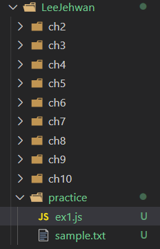

# **알파카고수 Modern JS 첫 과제입니다.**

이번 과제는 여러분들의 map, reduce를 체험해 보는 시간입니다. 또한 여러분들이 무엇이 필요하고 무엇을 조립해야 과제를 수행할 수 있는지 직접 찾아보는 시간입니다.
이번 과제는 반드시 여태 배운 JS에서 나오지 않습니다. 자바스크립트의 모든 문법을 배울 수 없기 때문에 직접 찾아보는 연습을 해 봐야 합니다.
과제는 다음과 같습니다. 
기존 본인의 directory 내에 practice 폴더를 만들고 js파일과 txt 파일을 만들어주세요.

그리고 sample.txt에 아래 글을 복사해 주세요.

> A wonderful serenity has taken possession of my entire soul, like these sweet mornings of spring which I enjoy with my whole heart. I am alone, and feel the charm of existence in this spot, which was created for the bliss of souls like mine. I am so happy, my dear friend, so absorbed in the exquisite sense of mere tranquil existence, that I neglect my talents. I should be incapable of drawing a single stroke at the present moment; and yet I feel that I never was a greater artist than now. When, while the lovely valley teems with vapour around me, and the meridian sun strikes the upper surface of the impenetrable foliage of my trees, and but a few stray gleams steal into the inner sanctuary, I throw myself down among the tall grass by the trickling stream; and, as I lie close to the earth, a thousand unknown plants are noticed by me: when I hear the buzz of the little world among the stalks, and grow familiar with the countless indescribable forms of the insects and flies, then I feel the presence of the Almighty, who formed us in his own image

## **assignment 1**

이제 ex1.js를 실행하면 각 단어의 개수를 출력해주는 프로그램을 만듭니다.
*	가급적 함수 단위로 쪼개서 만들어 주시기 바랍니다.
*	Text file을 read하여 사용해 주세요. *hint: fs
*	단어는 대소문자를 구분하지 않습니다.
*	, . ; : 과 같은 문자는 무시해야 합니다. 포함되면 안됩니다.
*	${단어이름} 의 개수는 ${단어개수} 의 format으로 출력해 주시면 됩니다. 

## **assignment 2**

두 번째 과제는 앞의 과제를 이용합니다.
여러분은 과제1번에서 함수를 이용하여 모듈화 하였을 것입니다. 

이를 그대로 이용하여 과제2번에서 사용해 봅시다. 

가급적 깔끔하게 코드를 짜봅시다. 

과제2는 과제1을 이용하여 질문에 답하는 것입니다. * hint: module, exports

* Q1. existence의 개수는 몇 개인가요?
* Q2. and의 개수는 몇 개인가요?
* Q3. a의 개수는 몇 개인가요?
* Q4. two의 개수는 몇 개인가요?
* Q5. 가장 많은 개수의 단어는 무엇이고 몇 개 인가요? (단, max, for를 이용하지 않아야 함)
* Q6. 가장 긴 단어는 무엇이고 몇 자인가요? (단, max, for를 이용하지 않아야 함)
